- [**XBOX ANTICIPATOR**](#--xbox-anticipator--)
  * [**INTRODUCTION**](#--introduction--)
    + [**PROJECT FUNCTIONALITY**](#--project-functionality--)
  * [PLEASE SEE [**CHALLENGES, BUGS and FIXES**](#challenges-bugs-and-fixes) SECTION BEFORE USE](#please-see----challenges--bugs-and-fixes-----challenges-bugs-and-fixes--section-before-use)
- [**UCD Phase 1: STRATEGY**](#--ucd-phase-1--strategy--)
  * [**PROJECT GOALS**](#--project-goals--)
  * [**USER STORIES:**](#--user-stories---)
  * [**GENERIC USER EXPECTATIONS:**](#--generic-user-expectations---)
- [**UCD Phase 2: SCOPE**](#--ucd-phase-2--scope--)
    + [Analysis and ***MoSCoW grading*** of ***User Stories:***](#analysis-and----moscow-grading----of----user-stories----)
- [**UCD Phase 3: STRUCTURE**](#--ucd-phase-3--structure--)
  * [**ENTITY RELATIONSHIP DIAGRAM**](#--entity-relationship-diagram--)
- [**UCD Phase 4: SKELETON**](#--ucd-phase-4--skeleton--)
  * [**INITIAL WIREFRAMES**](#--initial-wireframes--)
- [**UCD Phase 5: SURFACE**](#--ucd-phase-5--surface--)
  * [**DESIGN CHOICES**](#--design-choices--)
  * [Fonts](#fonts)
  * [Colours](#colours)
  * [Imagery](#imagery)
- [**TECHNOLOGIES**](#--technologies--)
  * [**LANGUAGES, VERSION CONTROL and FRAMEWORKS**](#--languages--version-control-and-frameworks--)
    + [HTML, CSS, JS & Python - core languages used to create this CRUD application:](#html--css--js---python---core-languages-used-to-create-this-crud-application-)
    + [VERSION CONTROL and FRAMEWORKS:](#version-control-and-frameworks-)
  * [**TOOLS USED**](#--tools-used--)
  * [Database](#database)
- [**FEATURES**](#--features--)
  * [**CURRENT FEATURES**](#--current-features--)
  * [***FEATURES TO IMPLEMENT***](#---features-to-implement---)
- [**TESTING**](#--testing--)
  * [CODE VALIDATION](#code-validation)
  * [W3C Validator Testing](#w3c-validator-testing)
  * [jshint Validator Testing](#jshint-validator-testing)
  * [PEP8 Validator Testing](#pep8-validator-testing)
  * [**MANUAL TESTING**](#--manual-testing--)
  * [Manual Testing Results Summary](#manual-testing-results-summary)
- [**DEVELOPMENT CYCLE**](#--development-cycle--)
  * [**PROJECT CHECKLIST**](#--project-checklist--)
  * [**DEPLOYMENT**](#--deployment--)
  * [**CHALLENGES, BUGS and FIXES**](#--challenges--bugs-and-fixes--)
    + [**Ongoing Bug Report: Image upload via CreateGameView form fails to attach to related POST request**](#--ongoing-bug-report--image-upload-via-creategameview-form-fails-to-attach-to-related-post-request--)
    + [**Bug: Scare: Sudden site-wide loss of CSS the day before submission!**](#--bug--scare--sudden-site-wide-loss-of-css-the-day-before-submission---)
    + [**Bug: Challenges finding, extracting and handling current_user_score value in GameDetailView**](#--bug--challenges-finding--extracting-and-handling-current-user-score-value-in-gamedetailview--)
    + [**Bug: Success message method not working for DeleteView:**](#--bug--success-message-method-not-working-for-deleteview---)
    + [**Bug: Date picker in Django form:**](#--bug--date-picker-in-django-form---)
    + [**CONTRIBUTERS**](#--contributers--)
  * [**CREDITS**](#--credits--)

<small><i><a href='http://ecotrust-canada.github.io/markdown-toc/'>Table of contents generated with markdown-toc</a></i></small>

=====

# **XBOX ANTICIPATOR**

## **INTRODUCTION**
This **fourth Portfolio Project** is the product of combined knowledege and techniques from all modules of the ***Code Institute Full Stack Developer Course*** to date, culminating in the creation of this **Full Stack Framework Django project**. This Application will allow an admin user to store and manipulate data records and also allow nominated staff users to create, read, update and delete additional data records for the **Xbox Anticipator** website.

A live version of the site can be found [here](https://pp04-xbox-anticipator.herokuapp.com/)

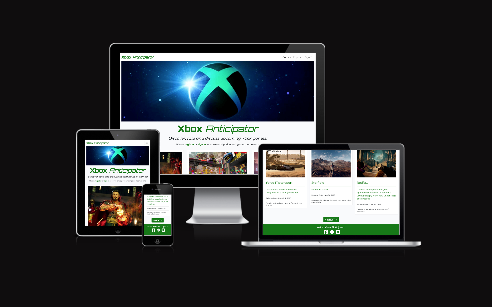

### **PROJECT FUNCTIONALITY**
The application uses **Django 3** to encourage rapid development, by utilising a *model-template-view* approach.
In conjunction with **Django**, **sqlite** was used in the Project's inception phase as a database for local testing. **Sqlite** is self-contained highly reliable, SQL database engine that includes all the normal relational database management features. Later, development was switched to **PostGreSQL** (aka **Postgres**), to ensure any data entered was visible in the deployed application. **Postgres** is open source and boosts a fully technical and easy to use object-relational database management system.
The project is version controlled via **Git** & **Github** and is deployed via **Heroku**. All environment & secret variables are stored in an `env.py` file, which is then held in a `.git-ignored` file, ensuring project integrity is held to a high security standard, in relation to project and present day requirements.

Using **Django** and the above Database methods the site owner, as an administrator for the application, has complete access to a custom Admin dashboard where they can Create, Read, Update and Delete records for each of the application models as appropriate. An `'is staff'` field was included in the User model specifically to allow for the creation of trusted community members as staff, with the ability to maintain, add to, delete and curate the database of upcoming Xbox games the **Xbox Anticipator** site showcases. 

To this end, please ensure when using the site and testing the **CRUD funcionality** of this application, **please log in as the non-admin, staff-enabled test user, Ben Kenobi:** 

| IS STAFF? | USER | EMAIL | PASSWORD | IS ADMIN? |
|-----|-----|-----|-----|-----|
| ***YES*** | ***Ben Kenobi*** | **kenobi@test.com** | **1234star4321** | NO |
| NO | Luke Skywalker | skywalker@test.com | 1234star4321 | NO |
| YES | Paul Whiteside | alfa23@test.com | alfa1606 | YES |

----

## PLEASE SEE [**CHALLENGES, BUGS and FIXES**](#challenges-bugs-and-fixes) SECTION BEFORE USE

----

# **UCD Phase 1: STRATEGY** 

## **PROJECT GOALS**

As an avid Xbox gamer, **Xbox Anticipator** is a personal proof of concept, with an aim that I'll continue building on it as my skills increase. **Xbox Anticipator** aims to showcase and gather feedback on the multitude of upcoming releases for Microsoft's next-gen-now consoles. However, with work and studies I have little time for gaming, let alone running a website, so I need the ability to put someone else in charge; luckily I have Ol' Ben Kenobi...

Base styling and project setup relies mainly on Bootstrap and initially borrows from Code Institute's Django Blog project but with my own custom models. Full CRUD functionality is demonstrated in the ability for staff users to create, update and delete **Xbox Anticipator** Game data directly through their browser. 

## **USER STORIES:**

A **GitHub** classic kanban project board was utilised throughout to log all ***User Stories***, track their progress and manage the project. This helped keep focus by moving them, in manageable batches, through *lanes*; from *"to do"* through *"in progress"* into ***"done"***, as they were completed.

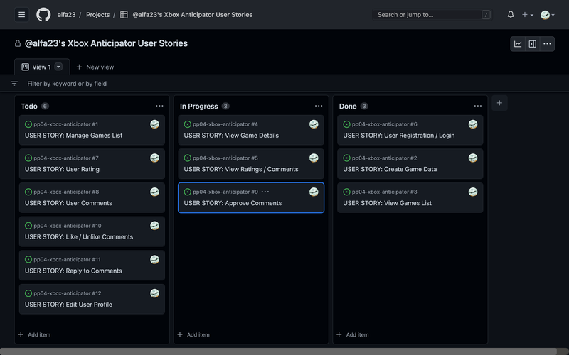

More **Kanban** screens [**here**](static/readme/anticipator_screens/kanban/).

***Unregistered User (Logged Out) Stories* include:**
- USER STORY #6: User Registration / Login
  As a new or returning user I can easily register / login so that I can rate anticipation for &/ comment on games.
- USER STORY #3: View Games List
  As a new or returning user I can view a list of games so that I can see which titles are upcoming.
- USER STORY #4: View Game Details
  As a new or returning user I can click on a game so that I can view all the related information.
- USER STORY #5: View Ratings / Comments
  As a site admin / new or returning user I can view game ratings / comments so that I can see how much games are anticipated and follow conversations.

***Registered User (Logged In) Stories* include:**
- USER STORY #7: User Rating
  As a registered user I can rate my anticipation for any game so that an average community 'Anticipation Rating' can be calculated.
- USER STORY #8: User Comments
  As a registered user I can leave comments on a game so that I can be involved in the conversation.

***Site Admin (Superuser) Stories* include:**
- USER STORY #1: Manage Games List
  As a staff user / site admin I can create, read, update & delete games so that I can easily manage content.
- USER STORY #2: Create Game Data
  As a staff user / site admin I can create game data so that add content to the site.
- USER STORY #9: Approve Comments
  As a site admin I can approve or disapprove comments so that I can manage objectionable content.
- USER STORY #11: Reply to Comments
  As a registered user I can reply to other users' comments so that I can be actively involved in the conversation.

***User Stories which fell outside of MVP solution*:**
- USER STORY #10: Like / Unlike Comments
  As a registered user I can like or unlike other users' comments so that I can interact with the community.
- USER STORY #12: Edit User Profile
  As a registered user I can view, edit & delete my user profile so that I can manage my content & data.

Due to the inevitable development delays due to learning challenges, bug squashing and the like, time and skills unfortunately didn't allow for all ***User Stories*** to be met. However, all *'Must Have'* and *'Should Have'* stories were satisfied and **MVP functionality** was achieved. As site owner I am slightly disappointed that all features weren't included in this iteration but I'm happy overall to have a working proof of concept I can build on.  

## **GENERIC USER EXPECTATIONS:**

- Intuitive/conventional navigation elements
- Familiar and/or easily understandable site structure
- Responsive: access site easily on any device

---- 

# **UCD Phase 2: SCOPE**

### Analysis and ***MoSCoW grading*** of ***User Stories:***

| USER STORY                                 | MoSCoW | 
|--------------------------------------------|:------:|
| USER STORY #1: Manage Games List           |  M     |
| USER STORY #2: Create Game Data            |  M     |
| USER STORY #3: View Games List             |  M     |
| USER STORY #4: View Game Details           |  M     |
| USER STORY #5: View Ratings / Comments     |  S     |
| USER STORY #6: User Registration / Login   |  M     |
| USER STORY #7: User Rating                 |  S     |
| USER STORY #8: User Comments               |  S     |
| USER STORY #9: Approve Comments            |  S     |
| USER STORY #10: Like / Unlike Comments     |  C / W |
| USER STORY #11: Reply to Comments          |  C / W |
| USER STORY #12: Edit User Profile          |  C / W |

***Proposed Production:*** Delivery of **MVP as a fully functioning solution**, with the potential exception of:
- USER STORY #10: Like / Unlike Comments
  As a registered user I can like or unlike other users' comments so that I can interact with the community.
- USER STORY #11: Reply to Comments
  As a registered user I can reply to other users' comments so that I can be actively involved in the conversation.
- USER STORY #12: Edit User Profile
  As a registered user I can view, edit & delete my user profile so that I can manage my content & data.

As stated previously, due to general project coding challenges and bugtime, it was fairly apparent midway through development that implementation of all user stories was unlikely. It was at this point, after brief investigations into integrating the user stories above, that I decided to focus on the work in progress and on **completing the sprints required to achieve a base MVP**. 

----

# **UCD Phase 3: STRUCTURE**

## **ENTITY RELATIONSHIP DIAGRAM** 

An ***Entitiy Relationship diagram*** was produced in order to better visualise the data to be stored in the database. It demonstrates the basic design upon which the database will be built. It specifies what data entities and attributes will be stored and how they relate to eachother.

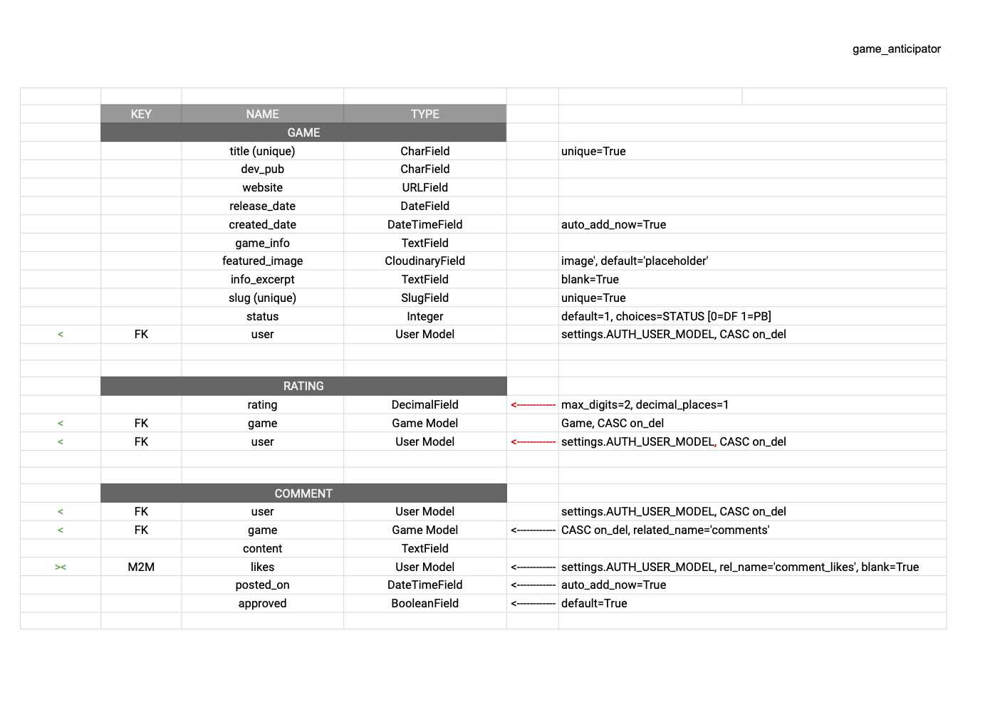

---- 

# **UCD Phase 4: SKELETON**

## **INITIAL WIREFRAMES**

Following current conventional practice, **Xbox Anticipator** was designed with a Mobile First approach.

----

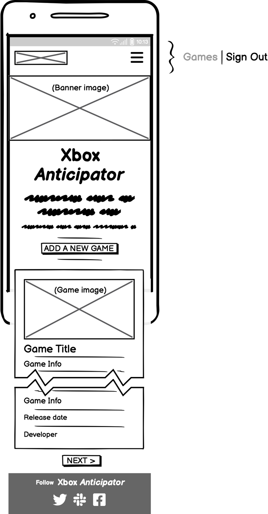

----

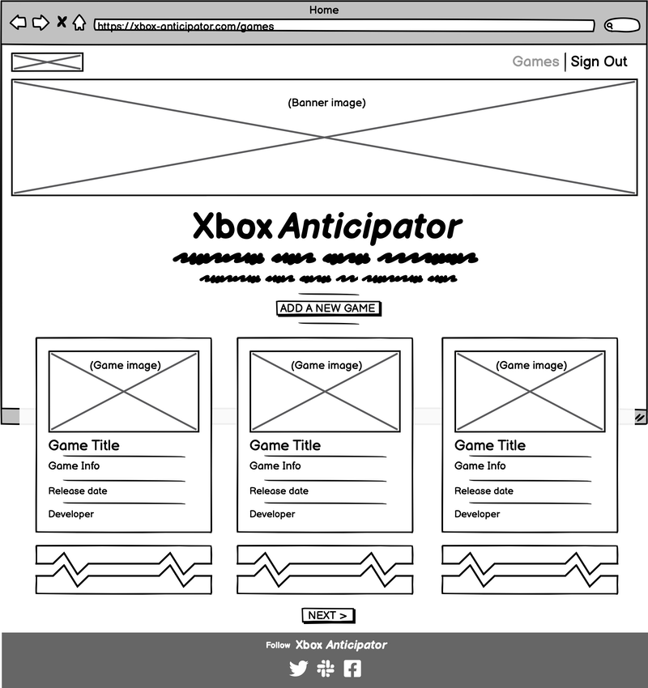

All wireframes generated in **[Balsamiq](https://balsamiq.com)**. A full set of PDF & PNG wireframes for mobile and desktop can be found [**here**](static/wireframes/).

---- 

# **UCD Phase 5: SURFACE**

## **DESIGN CHOICES**

## Fonts

All fonts utilised in this project were sourced from and served by [**Google Fonts**](https://fonts.google.com):

- **Heading Font:** *Orbitron*
  
  *Orbitron* is a geometric sans-serif typeface intended for display purposes, which stood out as an ideal choice for this project's header/logo when initially browsing Google Fonts. 

- **Body Font:** *Montserrat Alternates*

  *Montserrat Alternates* was chosen as a light, easy going body typeface; it's rounded bars and quirky typographic additions subtly contrast the weight and formality of **Orbitron**. Google informs usthat '...the old posters and signs in the traditional Montserrat neighborhood of Buenos Aires inspired Julieta to design this typeface and rescue the beauty of urban typography that emerged in the first half of the twentieth century.' Nice job, Julieta!

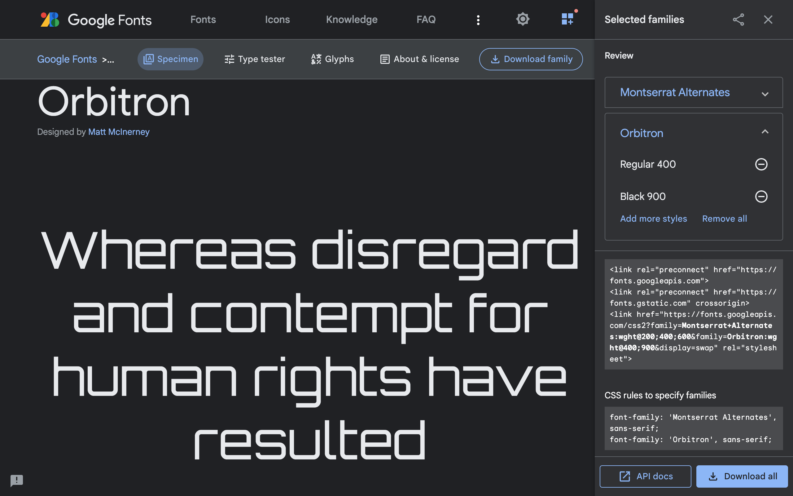

## Colours

Colours utilised were chosen with the **60:40:10 rule** in mind 

  • 60% Background/Primary - **#f8f8f8** *Guyabano* was chosen as a light, clean and calm alternative to white. Taken from *Original Xbox Green* list of Distantly Related Related colours.
  
  • 40% Body Text/Secondary: **#0e7a0d** *Original Xbox Green* chosen as it's a strong, brand-specific colour, which is familiar to Xbox users. Colour hex value referenced from: https://encycolorpedia.com/0e7a0d.
  
  • 10% Accent/Tertiary: **#960018** *Carmine* was chosen as a good contrasting accent colour to both Primary and Secondary colours. Taken from Original Xbox list of Intermediately Related colours, it is mainly utilised for link & button hover.

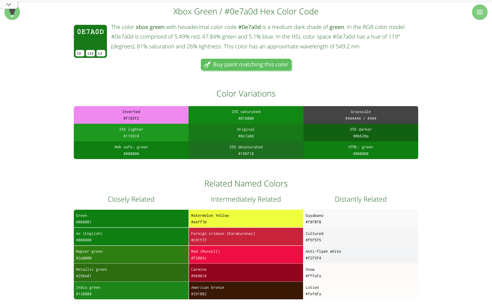

## Imagery

• Main page banner image:

  - The image utilised for the site header is a cropped version of an official Microsoft/Bethesda image, from a showcase event in mid-2022. 
  
    - Sourced from: https://assets.xboxservices.com/assets/5b/c0/5bc0beca-369a-495d-9212-1dca8fb43a62.jpg?n=294529_Super-Hero-1400_1920x1080.jpg

• Game images utilised sourced from: 
  
  - Forza Motorsport, High On Life, Marvel's Midnight Suns, Redfall & Starfield: https://www.gamesradar.com/upcoming-xbox-series-x-games/

  - Test Drive Unlimited: https://www.gameinformer.com/2021/04/21/new-test-drive-unlimited-solar-crown-trailer-promises-more-information-this-summer

  - Destiny 2: https://cdn.mos.cms.futurecdn.net/XfWpA7JeyVWyWzEBEVbyWk.jpg
  
• All copy used for game descriptions have their relevant sources credited in-body where appropriate. 

----

# **TECHNOLOGIES**

During the course of this project I have utilised the following technologies:

## **LANGUAGES, VERSION CONTROL and FRAMEWORKS**

### HTML, CSS, JS & Python - core languages used to create this CRUD application:
- **JavaScript** (https://www.javascript.com/) was used to add interactivity and enrich the User eXperience.
- **HTML5** (https://html.com/html5/) (HyperText Markup Language) was used for structuring & presenting site content.
- **CSS** (https://www.css3.info/) (Cascading Style Sheets) was used to provide styling to the HTML.
- **Python** (https://www.python.org/) 'Python is a programming language that lets you work quickly
and integrate systems more effectively.'

### VERSION CONTROL and FRAMEWORKS:
- **Git** (https://git-scm.com) was used for version control (commit to **Git** and push to **GitHub**.)
- **Gitpod** (https://www.gitpod.io/) was used to write my code; an online IDE linked to the **GitHub** repository.
- **GitHub** (https://github.com/) was used to create the repository and store the project's code after being pushed from **Git**.
- **Bootstrap Framework** (https://getbootstrap.com/) was used as the core structuring layout for the application, ensuring mobile-first design and screen size fluidity.
- **Bootstrap's Imported Javascript** & **JQuery** (https://getbootstrap.com/docs/4.3/getting-started/introduction/#js) used for Responsive Navbar expand & collapse, **roundSlider** and alert messages timeout functionality.
- **Django** (https://www.djangoproject.com/) was used as the architectural engine following the *model-template-view* approach.
- **Heroku** (https://www.heroku.com/) A cloud platform as a service enabling deployment of this **CRUD application**.

## **TOOLS USED**
- **PostgreSQL** A free, open-source relational database management system emphasizing extensibility and technical standards compliance.
- **Balsamiq** (https://balsamiq.com) used to generate mobile and desktop wireframes.
- **favicon** (https://www.favicon.cc/) was used to create a **custom favicon** for the project: 
- **roundSlider** (https://roundsliderui.com/) is a **jQuery plugin** that allows the user to select a value. Used to input and update *User Ratings* on the site. 
- **Google Chrome Dev Tools** (https://www.google.com/intl/en_uk/chrome/) used to debug & test source code using HTML5 and to test site responsiveness, also assisted in identifying the correct style properties to override some **Bootstrap** styling.
- **Google Fonts** (https://fonts.google.com) used for all fonts utilised in the project.
- **amiresponsive** (http://ami.responsivedesign.is/) used to check how responsive the site is on different devices.
- **JSHint** (https://jshint.com/), [**W3C Markup**] (https://validator.w3.org/) and [**W3C Jigsaw**] (http://jigsaw.w3.org/css-validator/) used to validate all source **JavaScript**, **HTML** & **CSS** code.
- **CI Python Linter** (https://pep8ci.herokuapp.com/) ***Code Institute's*** very own linter, used to check **Python code** is consistent with *PEP8* requirements.
- **Font Awesome Icons** (https://fontawesome.com/icons?d=gallery) used for social icons in footer and site-wide iconography.
- **ToC** (https://) used to generate ReadMe **Table of Content**.

## Database

The main database used for this Project was **Postgres**, as an installed add-on to the deployed Heroku Application. **Sqlite3** was used initially to test User Authentication, Registration & Login, and for testing the creation of Game data. However later in development I moved to local & deployed testing so **Postgres** was utilised from that point on.

When the app and its models were created and implemented, `python manage.py makemigrations` was run in the terminal to create the initial model package and `python manage.py migrate` was then used to apply the model to the database and create the table.
Where possible, first-time-right methodology was approached when creating the models to avoid to many alterations to the models and the database table through multiple `makemigrations` and `migrate` commands.

----

# **FEATURES**

## **CURRENT FEATURES**

**Full CRUD Functionality**

I know it was expected but, given my struggles with Django, I'm chuffed that I managed to get it working!

  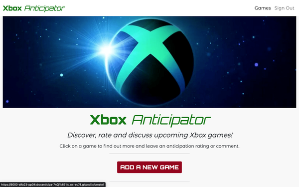
  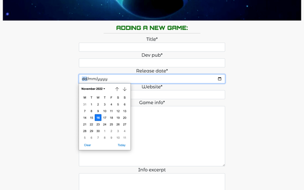
  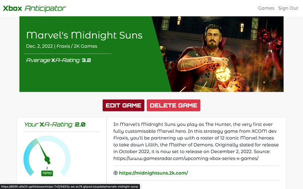
  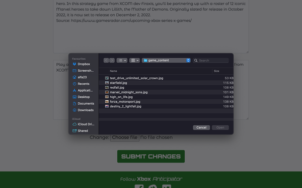
  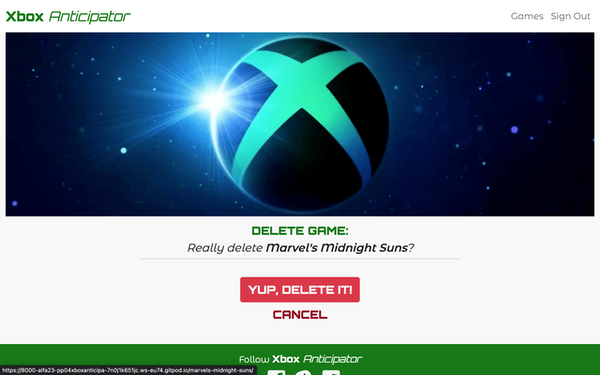
      
**roundSlider jQuery Input**

I was looking for a cool and slick way for registered users to post their rating scores and found **roundSlider** (https://roundsliderui.com/), a fully customisable circular slider input - I was sold! Although not a strong Scripter, with a little tinkering and experimenting on their excellent jsfiddle playground, I'm pleased with the final implementation. There are some issues with alignment I couldn't spare the time to fathom but, despite this, overall my favourite feature! 

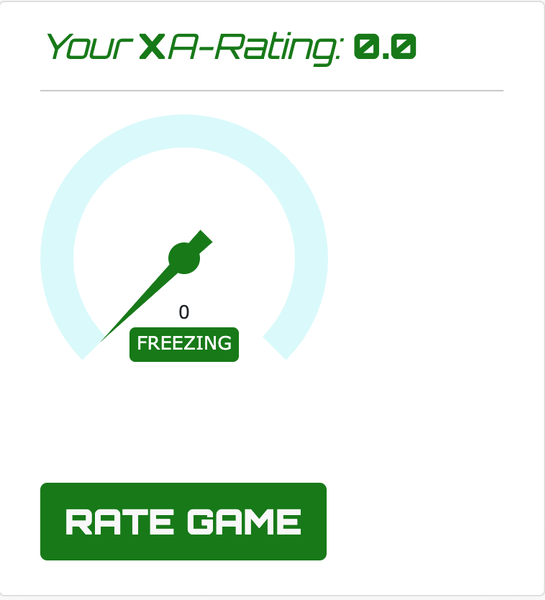
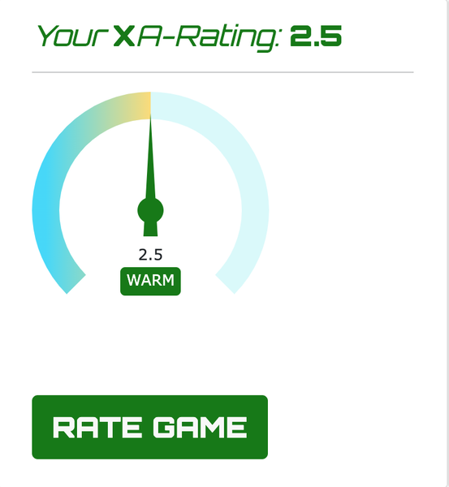
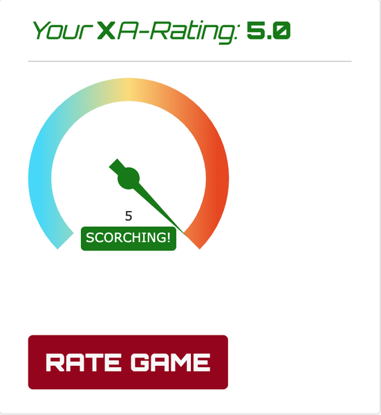

- Easily customisable **Tooltip labels**:

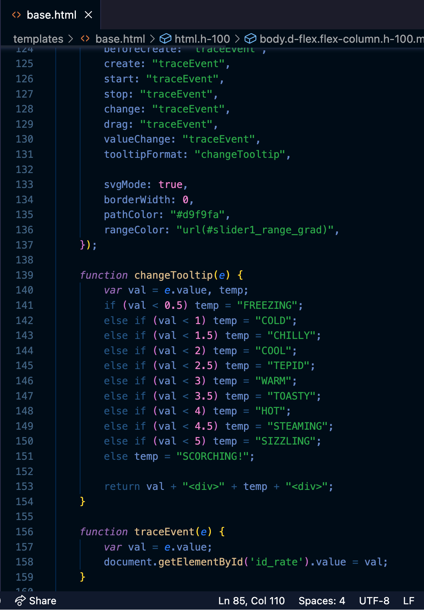

- **Average Ratings** update on page refresh reflecting freshly calculated Average Rating!

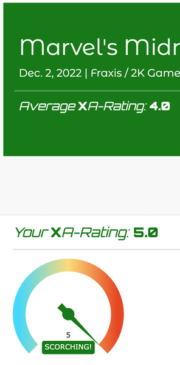
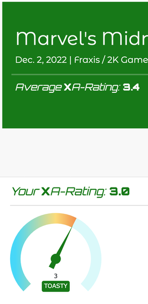
  
## ***FEATURES TO IMPLEMENT***

- Identified at ***UXD Phase 2***, goals relating to **comment likes & dislikes**, a **user profile page** and **in-comment replies** will be addressed initially, skills and time permitting, as and when possible! **Comment reply** - or at least simple conversations - effectively exist in the current MVP, with the comments being posted immediately and thus, immediately respondable. However, robust **in-line comment threads**, especially with the addition of the ability to **edit and delete**, would be the end goal. I did briefly look into this about halfway through development but it looked a little beyond the scope of this project. 

- In addition I would also like to consider implementing ***future features*** such as but not limited to:
  - Alternative **index views** functionality; the ability to view by average **Xbox Anticipator rating**/A-Z
  - The **average XA Rating** and **number of comments** also displaying on the **index view**
  - **Multi-image uploads** and display, plus a **video upload** field for trailers/user game clips
  - To help engender & develop **community**, the possible addition of a user **forum or chatroom**

----

# **TESTING**

## CODE VALIDATION

## W3C Validator Testing 

- HTML
  - Aside from ``, `{{ TEMPLATE VAR }}` and other template-related errors and warnings (for expected !DOCTYPE/title and adding language attributes, etc.), no further errors were returned when passing through the official [W3C validator](https://validator.w3.org)

| .html PAGE | RESULT |
|:-----:|:-----:|
| base | [VIEW](static/readme/anticipator_screens/code_validation/html/w3_html_base.png) |
| game_confirm_delete | [VIEW](static/readme/anticipator_screens/code_validation/html/w3_html_delete.png) |
| game_create | [VIEW](static/readme/anticipator_screens/code_validation/html/w3_html_create.png) |
| game_detail | [VIEW](static/readme/anticipator_screens/code_validation/html/w3_html_detail.png) |
| game_update | [VIEW](static/readme/anticipator_screens/code_validation/html/w3_html_update.png) |
| index | [VIEW](static/readme/anticipator_screens/code_validation/html/w3_html_index.png) |
| login | [VIEW](static/readme/anticipator_screens/code_validation/html/w3_html_login.png) |
| logout | [VIEW](static/readme/anticipator_screens/code_validation/html/w3_html_logout.png) |
| signup | [VIEW](static/readme/anticipator_screens/code_validation/html/w3_html_signup.png) |

- CSS
  - No errors were found when passing through the official [(Jigsaw) validator](https://jigsaw.w3.org)

    

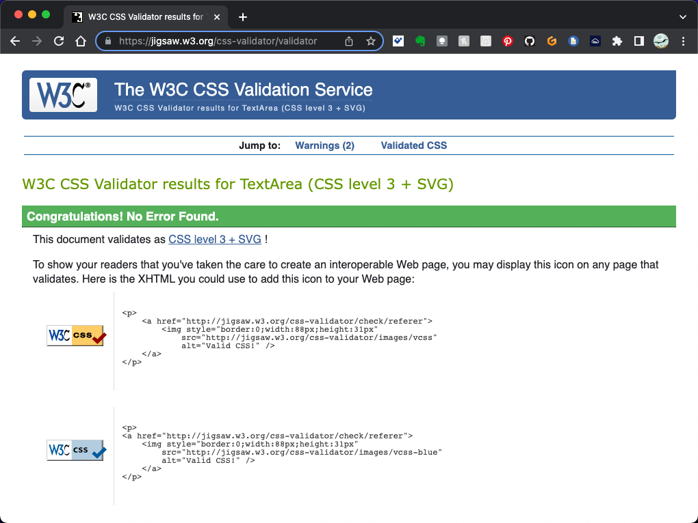

## jshint Validator Testing 

- JavaScript
  - No errors were returned when passing through the [JSHint validator](https://jshint.com/)

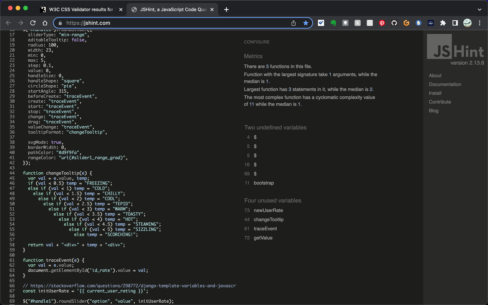

## PEP8 Validator Testing

- PEP8
  - All Project .py files passed through the [Code Institute Python Linter](https://pep8ci.herokuapp.com/) without issue

| APP | .py FILE | RESULT |
|:-----:|:-----:|:-----:|
| anticipator | urls | [VIEW](static/readme/anticipator_screens/code_validation/python/cipl_anticipator_urls.png) |
| xbox | admin | [VIEW](static/readme/anticipator_screens/code_validation/python/cipl_xbox_admin.png) |
| xbox | forms | [VIEW](static/readme/anticipator_screens/code_validation/python/cipl_xbox_forms.png) |
| xbox | managers | [VIEW](static/readme/anticipator_screens/code_validation/python/cipl_xbox_managers.png) |
| xbox | models | [VIEW](static/readme/anticipator_screens/code_validation/python/cipl_xbox_models.png) |
| xbox | urls | [VIEW](static/readme/anticipator_screens/code_validation/python/cipl_xbox_urls.png) |
| xbox | views | [VIEW](static/readme/anticipator_screens/code_validation/python/cipl_xbox_views.png) |

**Google Developer Tools**

- I made use of the built-in **Chrome Dev Tools** to experiment and debug while coding, in addition to testing simulated responsive behaviour across a range of mobile and desktop devices, and finally checking all pages Performance using **Lighthouse**. 

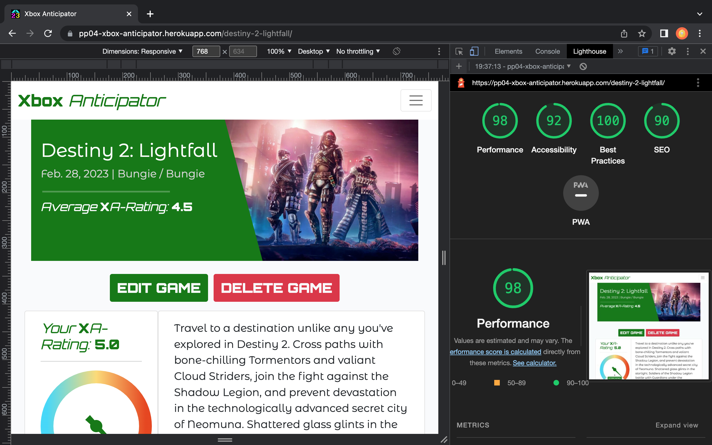

More **Lighthouse** test results in this folder [**here**](static/readme/anticipator_screens/lighthouse/).

**Response Testing**

In order to make sure that **Xbox Anticipator**** was responsive to all device sizes, I used [amiresponsive](http://ami.responsivedesign.is/)

## **MANUAL TESTING**

In addition to my own testing a link to the project was shared to family & friends for rigorous testing across varied devices and screen sizes.

- **Browsers** including: 
  - Chrome
  - Safari
  - Edge

- **Devices** including: 
  - iPhone 11
  - iPhone 12 Mini
  - Google Pixel 6
  - iPad Pro (2018)
  - iPad Air (2020)
  - MacBook Pro (2015)

## Manual Testing Results Summary

**TEST TABLE:**

| TEST | OUTCOME | PASS/FAIL |
|---|:---:|:---:|
| All users can view site and games | index.html/game_detail.html | PASS |
| All users can view any comments and ratings on games | game_detail.html | PASS |
| All users can easily register or login to access user features | signup.html/login.html | PASS |
| Registered users can leave comments | game_detail.html | PASS |
| Registered users can leave & adjust ratings | game_detail.html | PASS |
| *Unregistered* users can't leave comments | signup.html/login.html | PASS |
| *Unregistered* users can't leave/adjust ratings | signup.html/login.html | PASS |
| Registered users can log out easily | logout.html | PASS |
| Staff/admin users can easily create new data | game_create.html | PASS |
| Staff/admin users can easily update existing data | game_update.html | PASS |
| Staff/admin users can easily delete existing data | game_confirm_delete.html | PASS |
| Admin users can disapprove/remove comments (via Admin panel) | /admin | PASS |
| Admin users can esily remove users & all associated data (via Admin panel) | /admin | PASS |

----

# **DEVELOPMENT CYCLE**

## **PROJECT CHECKLIST**

- Install **Django** and supporting libraries

  - Install **Django** and **Gunicorn**. Gunicorn is the server utilised to run Django on Heroku
  - Install support libraries including **psycopg2**, used to connect the **PostgreSQL database**
  - Install **Cloudinary** libraries, a host provider service for persistent image storage
  - Create `requirements.txt` file, which includes the dependencies to allow the project to run in Heroku

- Create a new, blank **Django Project**

  - Create new project: `anticipator`
  - Create new app: `xbox`
  - Add `xbox` to the installed apps in *settings.py*
  - Migrate all new changes to the database
  - Run the server to test

- Setup project to use **Cloudinary** and **PostgreSQL**
 
  - Create new **Heroku app**
    - Sign into **Heroku**
    - Select *New*
    - Select *Create new app*
    - Enter a relevant app name
    - Select appropriate region
    - Select the *Create app* button

  - Attach **PostgreSQL database**
    - In **Heroku/Resources**
      - Search add-ons for *Postgres*
      - Select: *Heroku Postgres*
      - Submit order form
 
  - Prepare ***environment*** and ***settings.py*** files
 
    - Create `env.py` file
    - In `env.py`:Add `DATABASE_URL` with the **Postgres** `URL` from **Heroku**
    - Get a randomly generated **SECRET_KEY** *e.g.* from [key generator](https://django-secret-key-generator.netlify.app/)
    - In **Heroku**: Add `SECRET_KEY` + generated key to the `Config Vars`
    - In ***settings.py***: Add `if` statement to prevent production server from erroring
    - Replace insecure key with the environment variable for the `SECRET_KEY`
    - Add **Heroku** database as the back end
    - Migrate changes to new database

  - Get static media files stored on **Cloudinary**
    - Create **Cloudinary** account
    - From the dashboard, copy the `API environment variable`
    - In the *settings.py* file create a new environment variable for `CLOUDINARY_URL`
    - Add the `CLOUDINARY_URL` variable to **Heroku**
    - Add a temporary `Config Var` for `DISABLE_COLLECTSTATIC`
    - In *settings.py* add **Cloudinary** as an installed app
    - Add `static` and `media` file variables
    - Add templates directory
    - Change `DIR's` key to point to `TEMPLATES_DIR`
    - Add **Heroku** hostname to `allowed hosts`
    - Create directories for `media`, `static` and `templates` in the project workspace
    - Create a `Procfile`

- Deploy *new empty project* to **Heroku**

----

## **DEPLOYMENT**

This full stack application was developed using in-browser IDE **Gitpod Code** v1.73.1 and version controlled via local **(git)** and online **(github)** repository technologies. All secret environment variables were stored in an `env.py` file, which was added to a `.gitignore` file and out of the public repo. Those variables detailed in the `env.py` file were re-enacted in **Heroku/Settings** for this application under the `Config Vars` section, allowing the deployed site to utilise these secret variables.

The terminal was used to deploy the project locally:
- Create a repository on **GitHub** from the ***Code Institute full template***
- Open repository in source code editor **(GitPod)**
- Enter `python3 manage.py runserver` into the terminal
- Open local host address on web browser
- All local saved changes appear here

Deploying this application was achieved by:
- Pushing code from the IDE to **Github** via **Git** and the built-in **bash terminal**
- Creating an app on **Heroku** & deploying it from same
- Adding secret environment variables to the app's `Config Vars` in **Heroku/Settings** and assigning to the respective secret values held in the `env.py` for Live Deployment
- In **Heroku/Deploy**, deployment method set to **Github**
Final deployment to **Heroku**:
- Set `debug = False` in *settings.py* file
- Commit & push all files to **GitHub**
- In **Heroku/Settings**: Remove `DISABLE_COLLECTSTATIC` from `Config Vars`
- In **Heroku/Deploy**: Check auto deploy if required; click ***Deploy branch*** to deploy app 

A live link to this project can be found **[here](https://pp04-xbox-anticipator.herokuapp.com/)**.

To clone the repository:
- Select the Repository from **Github Dashboard**
- Click on the green 'Clone or download' button
- Click on the clipboard icon to the right of the `Git URL` to copy the web URL of the Clone
- Open your preferred Integrated Development Environment (IDE) and navigate to the terminal window
- Change the directory to where you want to clone the repository to
- Paste the `Git URL` copied from above and click 'Ok'
- Once open, create an `env.py` file and assign the *Database URL, Secret Key and other secret variables* - ensure the `env.py` is in the root project directory and add it to `.gitignore` to ensure any Secret details aren't exposed

----

## **CHALLENGES, BUGS and FIXES**

**IN-DEPLOYMENT BUG**

### **Ongoing Bug Report: Image upload via CreateGameView form fails to attach to related POST request**
  
  • *Issue:* I have been diligently searching for a solution to this issue, however I am guessing the **Django/CrispyForm** upload field may be broken or having issues with the attributed ***CloudinaryField***, as there are several ***SO*** posts alluding to this. When I had the opportunity I raised this issue with my Mentor, Marcel, and we had a good poke around trying to get it working but to no avail. Following a Google search and mentioning several things I didn't really understand, Marcel suggested adding the issue as an ongoing bug in the **Project ReadMe**. Obviously I know there likely is a solution, although it currently appears beyond my level of understanding. The image seems to attach to the *Create* request (see below) and the record is created successfully with no errors, just with the placeholder image instead of the desired uploaded one.
  
  • *Fix:* Despite welcome ***Mentor intervention***, the only method and **current workaround** is for an Admin to upload images via the Admin panel, where frustratingly the process works seamlessly. As this seems beyond my control and current understanding to rectify at present, I am hoping you will forgive this ongoing issue.  

- **Image** 'attaches' via upload dialog box and appears to be ready to send when form is posted..:

  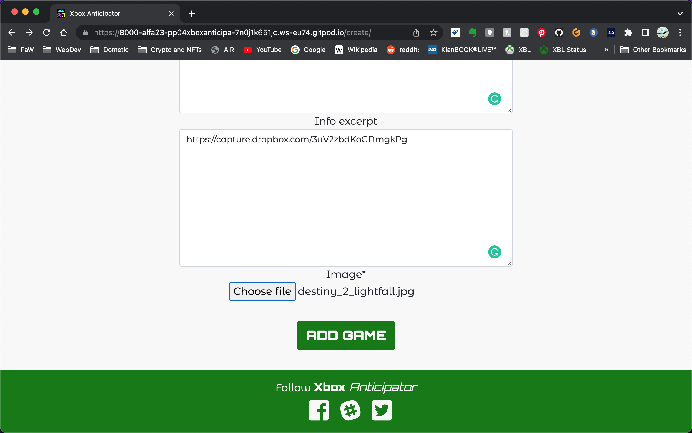

- Form **feature_image** field is ***Placeholder*** upon form submission - **ggrrr!**

  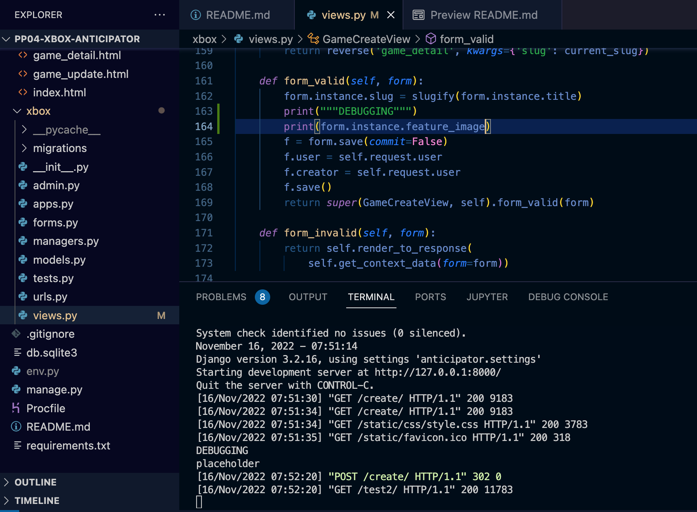

----

**SOLVED BUGS**

### **Bug: Scare: Sudden site-wide loss of CSS the day before submission!**
  
  • *Issue:* After a successful initial deploy of the final project, I discovered that I had failed **Heroku** deployments and a *divergent **Gitpod** branch* (I think this could be because I was commiting to my ReadMe file direct on Github possibly)... Subsequently I did a *merge* and all seemed fine, until the **CSS failed site-wide** and I now have **multiple errors** flagged on my ***.gitpod.yml***..!
  
  • *Fix:* After a panicked Slack message to Marcel, he suggested temporarily setting `debug = True` to see if that fixed it, which it did. I've yet to push and final-deploy these changes yet though, so fingers crossed! 

  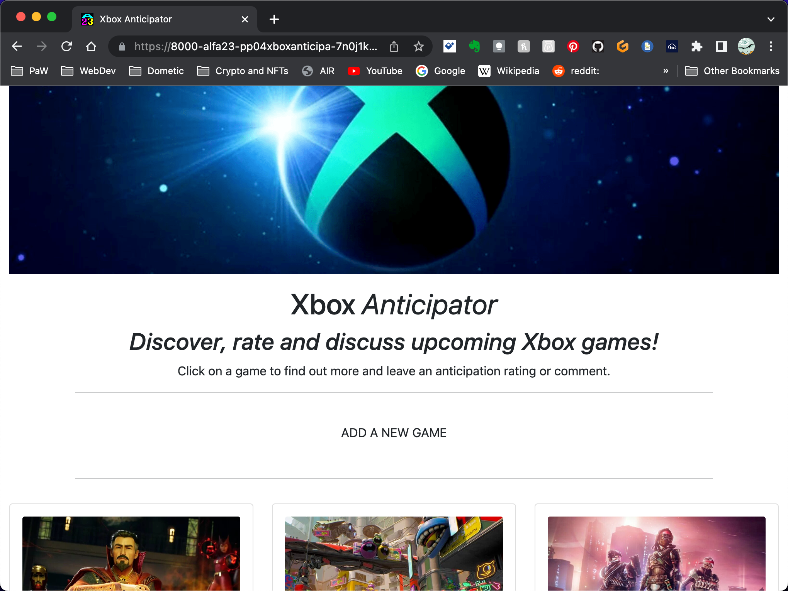
  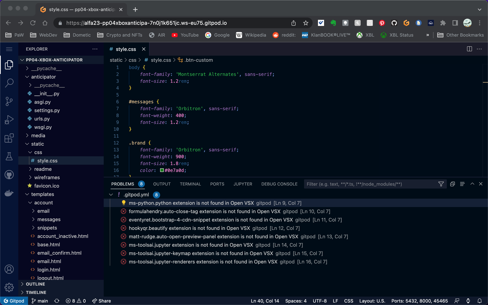

----

### **Bug: Challenges finding, extracting and handling current_user_score value in GameDetailView**
  
  • *Issue:* I spent hours, days maybe, chasing variables and figuring out how to target and extract them - the joy I felt late one evening when the number I was looking for turned up in a queryset! Then I just had to figure out how to get it out...
  
  • *Fix:* https://stackoverflow.com/questions/54815303/how-to-extract-data-from-django-queryset phew, did this one lead me down some ***StackOverflow*** rabbit holes!

  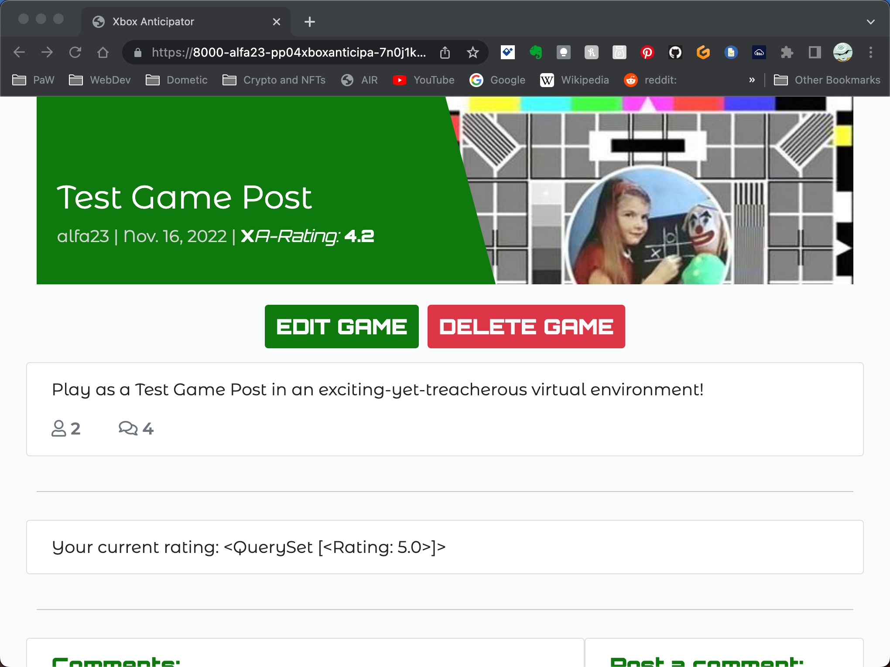
  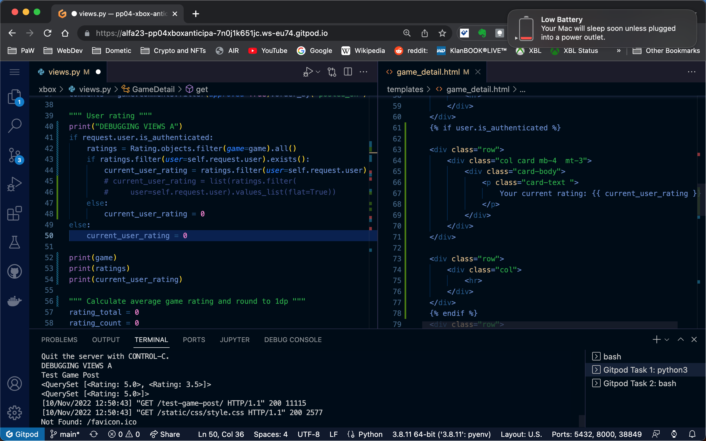

----

### **Bug: Success message method not working for DeleteView:**
  
  • *Issue:* Took me a little while to find out how best to implement messages on the *DeleteView*. 
  
  • *Fix:* Solution spotted on good ol' https://stackoverflow.com/questions/24822509/

  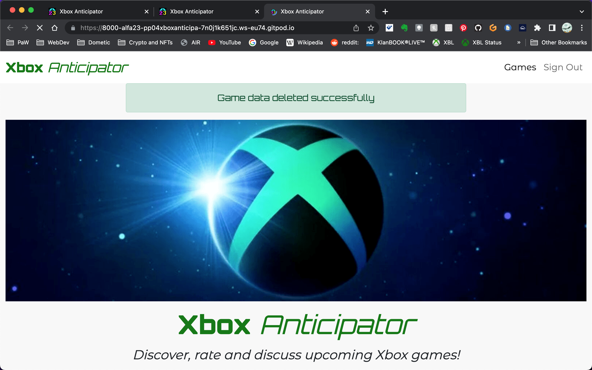

----

### **Bug: Date picker in Django form:**
  
  • *Issue:* Initial **Django/Crispy Form** renderings for *CreateView* weren't displaying a date picker in the input field, only the option to type dates manually.  
  
  • *Fix:* Code to enable DateInput widget referenced/sourced from: https://stackoverflow.com/questions/3367091/whats-the-cleanest-simplest-to-get-running-datepicker-in-django

  

----

### **CONTRIBUTERS**

Other coders code that I've referenced, learnt from, been inspired by or just plain borrowed:

• **All document fonts** sourced from google fonts:

• **All game images & info** is credited either under the **UCD Phase 5** IMAGERY section or in-copy within the application.

• **Django Custom User Model** process and code referenced/sourced from: https://testdriven.io/blog/django-custom-user-model/
  - After initial research I learnt that [the official Django documentation highly recommends using a custom user model instead. This provides far more flexibility down the line so, as a general rule, always use a custom user model for all new Django projects.](https://learndjango.com/tutorials/django-custom-user-model) To this end I found and followed the **testdriven.io** method as referenced above and did just that.

• **Settings for CustomUser email as username in Django-AllAuth** process and code referenced/sourced from: https://pyphilly.org/know-thy-user-custom-user-models-django-allauth/

• **Rating method theory & constraints** referenced/sourced from: https://stackoverflow.com/questions/58115738/realizing-rating-in-django to ensure rating uniqueness & range compliance.

----

## **CREDITS**

Firstly, I'd like to thank my family and folks for putting up with me during my studies! I'd also like to thank Mike, Aoife and the Code Institute Student Care team for their help and, well, care. Finally thanks go to my Mentor, Marcel, for his continuing support and advice. 

----

